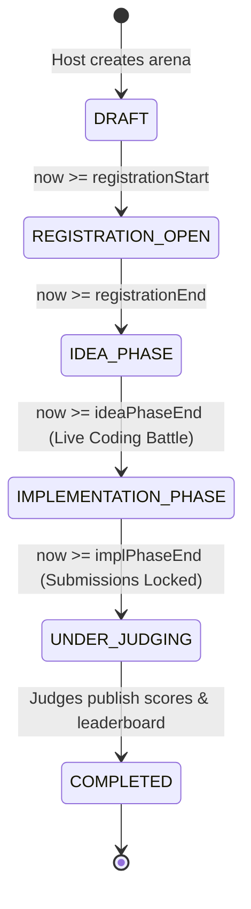

# 📘 Master Product Requirements Document (PRD) & Technical Blueprint
**Project**: Devs Arena Platform  
**Document Version**: 9.0 (Egypt-Centric Geolocation & Production Blueprint)  
**Classification**: High-Priority Product & Architecture Specification  
**Lead Authors**: Senior Business Developer & Principal Systems Architect  
**Status**: APPROVED FOR IMPLEMENTATION  

---

## 1. Document Overview & Strategic Mission

### 1.1 Executive Summary & Target Market Focus (Egypt)
**Devs Arena** is an engineering-first competition and skill-based hiring platform built specifically for the **Egyptian tech ecosystem**. 

Following the **Codeforces/Kaggle philosophy**, Devs Arena replaces unverified CV claims with **verifiable, time-boxed coding execution ("Build, Not Claim")** across Egyptian software engineers, startups, and tech hubs.

---

## 2. Egypt-Centric Geocoding & Venue Resolution Architecture

Instead of rigid, static city enums, locations across Egypt (for In-Person Arenas, Companies, and Developers) are dynamically resolved via **Google Places / Map Geocoding Services**:

```
┌─────────────────────────────────────────────────────────────┐
│ 1. Host selects "IN_PERSON" & provides Google Maps Pin URL  │
└──────────────────────────────┬──────────────────────────────┘
                               │
                               ▼
┌─────────────────────────────────────────────────────────────┐
│ 2. Automated Geocoding Service parses the location details: │
│    • locationName: "Smart Village, Building B12, Giza"      │
│    • governorate: "Giza"                                    │
│    • country: "Egypt"                                       │
│    • googleMapsUrl: "https://maps.google.com/?q=..."       │
└─────────────────────────────────────────────────────────────┘
```

### 2.1 Supported Egyptian Tech Hubs & Venues
- **Cairo Hubs**: New Cairo, Maadi Tech Ridge, Nasr City, Downtown Greek Campus.
- **Giza Hubs**: Smart Village, 6th of October, Dokki.
- **Alexandria Hubs**: Smouha, Sidi Gaber, Borg El Arab Tech Park.
- **Delta & Upper Egypt**: Mansoura Tech Hub, Tanta, Assiut Silicon Waha.
- **Remote / Online**: Virtual arenas across all Egyptian governorates.

---

## 3. Standardized Platform Enums & Taxonomy Catalog

### 3.1 Industry & Vertical Classification (`IndustryType`)
```prisma
enum IndustryType {
  FINTECH
  ARTIFICIAL_INTELLIGENCE
  HEALTH_TECH
  E_COMMERCE
  ED_TECH
  LOGISTICS_SUPPLY_CHAIN
  CYBERSECURITY
  DEVELOPER_TOOLS
  GAMING_ENTERTAINMENT
  ENTERPRISE_SAAS
  TELECOMMUNICATIONS
  GREEN_TECH
  OTHER
}
```

### 3.2 Company Size & Scale (`CompanySize`)
```prisma
enum CompanySize {
  SEED          // 1–10 employees
  STARTUP       // 11–50 employees
  GROWTH        // 51–200 employees
  MID_MARKET    // 201–1,000 employees
  ENTERPRISE    // 1,000+ employees
}
```

### 3.3 Arena Technical Domain (`ArenaDomain`)
```prisma
enum ArenaDomain {
  FULL_STACK_WEB
  BACKEND_DISTRIBUTED
  FRONTEND_MOBILE
  AI_MACHINE_LEARNING
  DATA_ENGINEERING
  CYBERSECURITY_ETHICAL_HACKING
  SYSTEMS_DEV_OPS
  EMBEDDED_IOT
  BLOCKCHAIN_WEB3
}
```

### 3.4 Developer Seniority Level (`SeniorityLevel`)
```prisma
enum SeniorityLevel {
  ENTRY_LEVEL   // 0–2 years
  MID_LEVEL     // 2–5 years
  SENIOR_LEVEL  // 5–8 years
  LEAD_STAFF    // 8+ years
}
```

### 3.5 Work Availability Status (`WorkAvailability`)
```prisma
enum WorkAvailability {
  ACTIVELY_LOOKING      // Ready for immediate interview & hire
  OPEN_TO_OFFERS        // Passively exploring
  OPEN_TO_SQUADS_ONLY   // Competing for XP / Fun only
  NOT_AVAILABLE         // Employed / Unavailable
}
```

### 3.6 Prize Currency (`PrizeCurrency`)
```prisma
enum PrizeCurrency {
  EGP
  USD
  EUR
  SAR
  AED
}
```

### 3.7 Dispute & Report Category (`DisputeCategory`)
```prisma
enum DisputeCategory {
  PLAGIARISM_STOLEN_CODE
  RULE_VIOLATION
  BROKEN_OR_FAKE_SUBMISSION
  ABUSIVE_HARASSMENT
  SPAM_OR_OFF_TOPIC
}
```

---

## 4. Multi-Tenant Corporate Architecture & Context Switching

```
┌─────────────────────────────────────────────────────────────────────────┐
│                      ACTIVE USER CONTEXT SWITCHER                       │
│                                                                         │
│  [ Active Context: Coon Cluster AI (Enterprise) ▾ ]                     │
│  ├── 🏢 Coon Cluster (Role: Recruiter)                                  │
│  ├── 🏢 Vodafone Egypt (Role: Billing Manager)                          │
│  └── 👤 Personal Profile (Role: Developer / Contestant)                 │
└─────────────────────────────────────────────────────────────────────────┘
```

### 4.1 Multi-Company Membership
A single developer account can be associated with multiple companies simultaneously while retaining an independent personal contestant profile.

### 4.2 Company Corporate Sub-Roles
1. **`COMPANY_OWNER` / `COMPANY_ADMIN`**: Full company settings control, hiring arena creation, recruiter seat allocation, member management.
2. **`RECRUITER`**: Access to candidate pipelines (`/recruiter/pipeline`), code inspection, candidate tagging, and contact export.
3. **`BILLING_MANAGER`**: Access to subscription invoices, seat limits, plan upgrades, and payment settings.

---

## 5. Granular Roles & Permissions Architecture (RBAC 2.0)

### 5.1 Granular Permissions Catalog
- **Arena Permissions**: `arena:create_official`, `arena:create_company`, `arena:create_community`, `arena:edit`, `arena:delete`, `arena:manage_disputes`.
- **Recruiter CRM Permissions**: `recruiter:view_pipeline`, `recruiter:inspect_code`, `recruiter:export_contacts`, `recruiter:tag_candidates`.
- **Company Management Permissions**: `company:manage_profile`, `company:invite_members`, `company:remove_members`, `company:assign_roles`.
- **Billing Permissions**: `billing:view_invoices`, `billing:manage_subscription`, `billing:upgrade_seats`.

### 5.2 Endpoint: `/api/auth/me`
Returns the active session authorization payload:
```json
{
  "user": { "id": "uuid", "handle": "alex_dev", "email": "alex@coon.ai" },
  "activeCompany": { "id": "uuid", "name": "Coon Cluster", "role": "RECRUITER" },
  "permissions": [
    "arena:create_company",
    "recruiter:view_pipeline",
    "recruiter:inspect_code",
    "recruiter:export_contacts"
  ]
}
```

---

## 6. Developer Profile Standards & The "Dev Graph"

### 6.1 Developer Profile Standards (`/profile/[handle]`)
1. **Verified OAuth Connections**: GitHub OAuth (commits, repos) + LinkedIn OAuth (verified identity).
2. **Yearly Activity Heatmap**: Punch-card grid visualizing contest participation, problem solutions, and code submissions.
3. **Arena Placements & Trophies**: Digital trophy cabinet (`🥇 1st Place - Cairo Cyberpunk Battle`, `🥈 Top 5% System Architect`).
4. **Verified Skill Radar**: Verified skill ratings automatically derived from completed arena tech tags.
5. **Work Availability Status**: `WorkAvailability` enum.

### 6.2 The Developer Connection Graph (`[ ⚡ CONNECT ]`)
- **1-Click Connect**: Connect with developer peers across Egypt.
- **Squad Auto-Suggest**: Connected peers appear at the top of squad matchmaking invite lists.
- **Viral FOMO Alerts**: Notifications when connections register for high-stakes arenas (`"Ahmed and 2 connections registered for Cairo Battle!"`).

---

## 7. Arena Architecture, Governance & Prize Pools

### 7.1 Three-Tier Authority Matrix

| Authority Tier | Permitted Creator | Visual Badge | Global XP? | Cash Prize Eligible? |
| :--- | :--- | :--- | :---: | :---: |
| **`OFFICIAL`** | Platform Superadmins | Gold `[ OFFICIAL ARENA ]` | 🟢 **FULL XP** | 🟢 **YES** |
| **`COMPANY`** | Verified Corporate Accounts | Blue `[ COMPANY ARENA ]` | 🟢 **FULL XP** | 🟢 **YES** (Paid Tier) |
| **`COMMUNITY`** | Any Developer Contestant | Neutral `[ COMMUNITY ARENA ]` | 🔴 **0 XP** (Anti-Cheat) | 🔴 **BLOCKED (V1)** |

### 7.2 Non-Custodial Prize Pool Legal Shield
- **Prize Fields**: `hasPrizePool`, `totalPrizePool`, `prizeCurrency` (`PrizeCurrency` enum, default: `EGP`), `firstPlacePrize`, `secondPlacePrize`, `thirdPlacePrize`.
- **Non-Custodial Legal Disclaimer**:
  > ⚖️ **Legal Notice**: *Prize fulfillment, tax obligations, and monetary disbursements are sponsored and managed directly by the Arena Organizer/Company. Devs Arena operates strictly as the technical evaluation and leaderboard platform.*

---

## 8. Mathematical Difficulty Scale & Real-Time State Machine

### 8.1 Mathematical XP Formula
$$\text{Total Earned XP} = \Big( \text{Base XP} \times \text{Difficulty Multiplier} \times \text{Placement Multiplier} \Big) + \text{Participation Bonus}$$

```
┌──────────────────┬──────────┬────────────┬────────────────────────────────────────────┐
│ Difficulty Tier  │ Base XP  │ Multiplier │ Technical Complexity & Scope               │
├──────────────────┼──────────┼────────────┼────────────────────────────────────────────┤
│ NOVICE           │ 100 XP   │ 1.0x       │ Basic CRUD, Algorithmic Katas, UI Design   │
│ INTERMEDIATE     │ 250 XP   │ 1.5x       │ Full-stack integrations, Auth, Caching     │
│ ADVANCED         │ 600 XP   │ 2.5x       │ Distributed microservices, WebSockets      │
│ GRANDMASTER      │ 1,500 XP │ 4.0x       │ Consensus algorithms, High-throughput systems│
└──────────────────┴──────────┴────────────┴────────────────────────────────────────────┘
```

### 8.2 Automated Timestamp State Machine



---

## 9. Comprehensive Database Schema (Prisma Data Model)

```prisma
enum Role {
  USER
  ADMIN
}

enum CompanyRole {
  OWNER
  ADMIN
  RECRUITER
  BILLING_MANAGER
}

enum ArenaAuthority {
  OFFICIAL
  COMPANY
  COMMUNITY
}

enum ArenaIntent {
  HIRING_ASSESSMENT
  BRAND_HACKATHON
  COMMUNITY_FUN
}

enum DifficultyTier {
  NOVICE
  INTERMEDIATE
  ADVANCED
  GRANDMASTER
}

enum IndustryType {
  FINTECH
  ARTIFICIAL_INTELLIGENCE
  HEALTH_TECH
  E_COMMERCE
  ED_TECH
  LOGISTICS_SUPPLY_CHAIN
  CYBERSECURITY
  DEVELOPER_TOOLS
  GAMING_ENTERTAINMENT
  ENTERPRISE_SAAS
  TELECOMMUNICATIONS
  GREEN_TECH
  OTHER
}

enum CompanySize {
  SEED
  STARTUP
  GROWTH
  MID_MARKET
  ENTERPRISE
}

enum ArenaDomain {
  FULL_STACK_WEB
  BACKEND_DISTRIBUTED
  FRONTEND_MOBILE
  AI_MACHINE_LEARNING
  DATA_ENGINEERING
  CYBERSECURITY_ETHICAL_HACKING
  SYSTEMS_DEV_OPS
  EMBEDDED_IOT
  BLOCKCHAIN_WEB3
}

enum SeniorityLevel {
  ENTRY_LEVEL
  MID_LEVEL
  SENIOR_LEVEL
  LEAD_STAFF
}

enum WorkAvailability {
  ACTIVELY_LOOKING
  OPEN_TO_OFFERS
  OPEN_TO_SQUADS_ONLY
  NOT_AVAILABLE
}

enum PrizeCurrency {
  EGP
  USD
  EUR
  SAR
  AED
}

enum LocationType {
  ONLINE
  IN_PERSON
}

enum ArenaStatus {
  DRAFT
  REGISTRATION_OPEN
  IDEA_PHASE
  IMPLEMENTATION_PHASE
  UNDER_JUDGING
  COMPLETED
}

model Company {
  id               String            @id @default(uuid()) @db.Uuid
  name             String
  slug             String            @unique
  domain           String            @unique
  logoUrl          String?
  bio              String?           @db.Text
  websiteUrl       String?
  locationName     String?           // e.g. "Smart Village, Building B12, Giza"
  governorate      String?           @default("Cairo")
  country          String            @default("Egypt")
  industry         IndustryType      @default(DEVELOPER_TOOLS)
  size             CompanySize       @default(STARTUP)
  techStack        String[]
  isVerified       Boolean           @default(false)
  
  // Subscriptions & Limits
  subscriptionTier String            @default("FREE")
  maxRecruiters    Int               @default(2)
  
  // Relations
  members          CompanyMember[]
  arenas           Arena[]
  isDeleted        Boolean           @default(false)
  deletedAt        DateTime?
  createdAt        DateTime          @default(now())
  updatedAt        DateTime          @updatedAt

  @@map("companies")
}

model CompanyMember {
  id          String        @id @default(uuid()) @db.Uuid
  companyId   String        @db.Uuid
  company     Company       @relation(fields: [companyId], references: [id], onDelete: Cascade)
  userId      String        @db.Uuid
  user        User          @relation(fields: [userId], references: [id], onDelete: Cascade)
  role        CompanyRole   @default(RECRUITER)
  
  inviteToken String?       @unique
  isAccepted  Boolean       @default(false)
  isApproved  Boolean       @default(true)
  
  createdAt   DateTime      @default(now())
  updatedAt   DateTime      @updatedAt

  @@unique([companyId, userId])
  @@map("company_members")
}

model Arena {
  id                       String            @id @default(uuid()) @db.Uuid
  title                    String
  description              String            @db.Text
  authority                ArenaAuthority    @default(COMMUNITY)
  intent                   ArenaIntent       @default(COMMUNITY_FUN)
  difficulty               DifficultyTier    @default(INTERMEDIATE)
  domain                   ArenaDomain       @default(FULL_STACK_WEB)
  
  // Location Architecture
  locationType             LocationType      @default(ONLINE)
  locationName             String?           // e.g. "Greek Campus, Downtown Cairo"
  governorate              String?           @default("Cairo")
  country                  String            @default("Egypt")
  googleMapsUrl            String?
  
  // Host & Access
  creatorId                String            @db.Uuid
  creator                  User              @relation(fields: [creatorId], references: [id], onDelete: Cascade)
  companyId                String?           @db.Uuid
  company                  Company?          @relation(fields: [companyId], references: [id], onDelete: SetNull)
  isPrivate                Boolean           @default(false)
  inviteCode               String?           @unique
  requireHiringConsent     Boolean           @default(false)
  
  // Prize Pool Configuration
  hasPrizePool             Boolean           @default(false)
  totalPrizePool           Float?
  prizeCurrency            PrizeCurrency     @default(EGP)
  firstPlacePrize          Float?
  secondPlacePrize         Float?
  thirdPlacePrize          Float?
  prizeDisbursementTerms   String?           @db.Text
  
  // Timeline Windows
  registrationStart        DateTime
  registrationEnd          DateTime
  ideaPhaseStart           DateTime
  ideaPhaseEnd             DateTime
  implPhaseStart           DateTime
  implPhaseEnd             DateTime
  
  // Squad Limits
  isTeam                   Boolean           @default(false)
  minTeamSize              Int               @default(1)
  maxTeamSize              Int               @default(1)
  maxParticipants          Int?
  allowLeaderAccessControl Boolean?          @default(true)
  
  // Deliverable Checklist
  requireGithubUrl         Boolean           @default(true)
  requireFigmaUrl          Boolean           @default(false)
  requireVideoUrl          Boolean           @default(false)
  requireWriteup           Boolean           @default(true)
  rulesText                String            @db.Text

  // Relations & Soft Delete
  comments                 ArenaComment[]
  teams                    ArenaTeam[]
  submissions              ArenaSubmission[]
  tags                     TagOnArena[]
  isDeleted                Boolean           @default(false)
  deletedAt                DateTime?
  createdAt                DateTime          @default(now())
  updatedAt                DateTime          @updatedAt

  @@map("arenas")
}

model ArenaComment {
  id        String         @id @default(uuid()) @db.Uuid
  arenaId   String         @db.Uuid
  arena     Arena          @relation(fields: [arenaId], references: [id], onDelete: Cascade)
  authorId  String         @db.Uuid
  author    User           @relation(fields: [authorId], references: [id], onDelete: Cascade)
  parentId  String?        @db.Uuid
  parent    ArenaComment?  @relation("CommentReplies", fields: [parentId], references: [id], onDelete: Cascade)
  replies   ArenaComment[] @relation("CommentReplies")
  content   String         @db.Text
  likes     Int            @default(0)
  isPinned  Boolean        @default(false)
  isDeleted Boolean        @default(false)
  deletedAt DateTime?
  createdAt DateTime       @default(now())
  updatedAt DateTime       @updatedAt

  @@map("arena_comments")
}

model ArenaSubmission {
  id           String     @id @default(uuid()) @db.Uuid
  arenaId      String     @db.Uuid
  arena        Arena      @relation(fields: [arenaId], references: [id], onDelete: Cascade)
  teamId       String?    @db.Uuid
  team         ArenaTeam? @relation(fields: [teamId], references: [id], onDelete: Cascade)
  userId       String     @db.Uuid
  user         User       @relation(fields: [userId], references: [id], onDelete: Cascade)
  
  githubUrl    String
  figmaUrl     String?
  videoUrl     String?
  writeupText  String     @db.Text
  score        Float?
  rank         Int?
  feedbackText String?    @db.Text
  
  isDeleted    Boolean    @default(false)
  deletedAt    DateTime?
  createdAt    DateTime   @default(now())
  updatedAt    DateTime   @updatedAt

  @@unique([arenaId, userId])
  @@map("arena_submissions")
}

model UserFollow {
  id          String   @id @default(uuid()) @db.Uuid
  followerId  String   @db.Uuid
  follower    User     @relation("UserFollowers", fields: [followerId], references: [id], onDelete: Cascade)
  followingId String   @db.Uuid
  following   User     @relation("UserFollowing", fields: [followingId], references: [id], onDelete: Cascade)
  createdAt   DateTime @default(now())

  @@unique([followerId, followingId])
  @@map("user_follows")
}
```

---

## 10. REST API Contracts & Endpoints

| Method | Endpoint | Auth Level | Description |
| :--- | :--- | :--- | :--- |
| `GET` | `/api/auth/me` | `GUEST` / `USER` | Returns current user, active company, roles, and granular permissions list. |
| `POST` | `/api/auth/switch-context` | `USER` | Switches active company context for the session. |
| `GET` | `/api/companies` | `GUEST` | Dynamic directory listing with `IndustryType` and location search filters. |
| `POST` | `/api/companies` | `USER` | Creates a new company with domain verification token. |
| `POST` | `/api/companies/[id]/invite` | `COMPANY_ADMIN`| Invites a recruiter/billing manager via email double-handshake. |
| `POST` | `/api/arena` | `USER` | Creates an arena with authority, difficulty, domain, prize pool, and timeline. |
| `GET` | `/api/arena` | `GUEST` | Dynamic listing with keyword search, authority, and domain filters. |
| `GET` | `/api/arena/[id]/comments` | `GUEST` | Fetches nested discussion threads with upvotes and host pins. |
| `POST` | `/api/arena/[id]/comments` | `USER` | Posts a top-level comment or nested reply. |
| `POST` | `/api/arena/[id]/teams` | `USER` | Creates a squad lobby with privacy mode and meeting URL. |
| `POST` | `/api/arena/[id]/submit` | `USER` | Submits final deliverables (GitHub, Video, Writeup). |
| `POST` | `/api/user/[id]/follow` | `USER` | Connects/Follows another developer in the Dev Network. |
| `GET` | `/api/recruiter/pipeline` | `RECRUITER` | Retrieves candidate code submissions, scores, and contacts. |

---

## 11. Explicit Non-Goals (Scope Boundary)

To protect solo founder bandwidth and guarantee rapid launch:
- ❌ Built-in WebSocket Text/Voice Chat (delegated to unlocked external meeting rooms).
- ❌ In-App Payment Processing Gateways (monetized via direct enterprise invoice/sponsorship).
- ❌ Video Transcoding Servers (handled via external YouTube/Loom demo links).
- ❌ Two-Factor SMS Authentication (deferred to Post-MVP).
